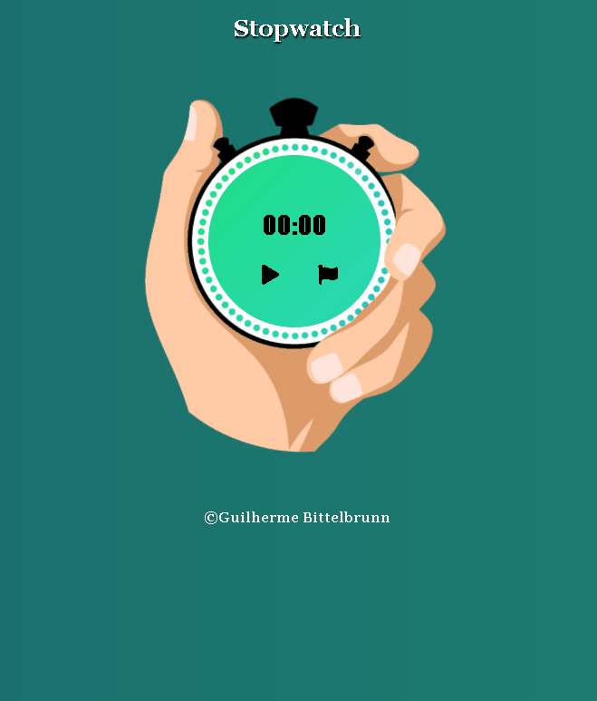

<main style="text-align:center">
    <h1><strong>Stopwatch</strong></h1>
    <h3><strong>Criado utilizando apenas html/css/js</strong></h3>
    
Stopwatch ou cronômetro possui uma interface de relógio e todas as funcionabilidades do mesmo

    <ul>
        <li>Iniciar contator</li>
        <li>Pausar contador</li>
        <li>Adicionar uma volta</li>
        <li>Reiniar contagem</li>
        <li>Animações ao contar e pausar</li>
    </ul>
    
    

    <h3><a href="https://guilhermebittelbrunn.github.io/stopwatch/"> Clique aqui para ver o site</a></h3>
    
Created by: Guilherme Bittelbrunn

</main>

<!-- https://guilhermebittelbrunn.github.io/stopwatch/ -->
